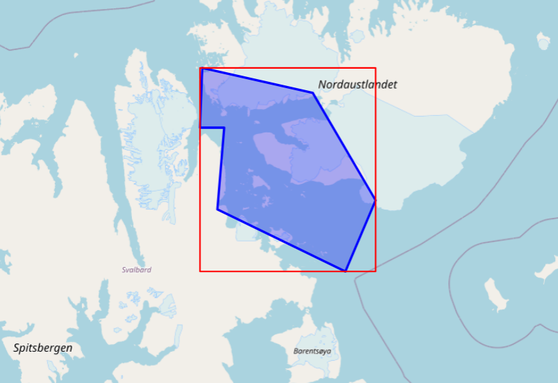

[[geographic_extentrectangle]]
=== geographic_extent/rectangle

[cols="2,8"]
|=======================================================================
|Element |/mmd/geographic_extent/rectangle

|Attributes |srsName

|Required |Yes

|Repetition allowed |No

|Description a|The geographic extend of the datasets defined a rectangle
in lat/lon projection. The extent is defined using the following child
elements:

* north: The northernmost point covered by the dataset.
* south: The southernmost point covered by the dataset.
* west: The westernmost point covered by the dataset.
* east: The easternmost point covered by the dataset.

The allowed values of east and west (i.e. the longitude values) must be within -180:180, while the allowed values for north and south (i.e. the latitude values),
must be within -90:90.
Generally the upper right longitude will be greater than the lower left longitude (i.e. east > west). However when the area crosses the (+/-)180° antimeridian (dateline crossing),
the value of the lower left longitude will be greater than the value of the upper right longitude (east < west).

It is recommended to provide at least 2 decimals for the values.

The default value of the srsName is "EPSG:4326".

To provide, in addition, more detailed information about the geographic extent see <<geographic_extentpolygon>>.

|Example XML: a|
----
<geographic_extent>
 <rectangle srsName="EPSG:4326">
  <north>79.95893</north>
  <south>78.874289</south>
  <east>23.203125</east>
  <west>18.105469</west>
 </rectangle>
</geographic_extent>
----
|DIF equivalent |/DIF/Spatial_Coverage

|ISO equivalent
|/gmd:MD_Metadata/gmd:identificationInfo/gmd:MD_DataIdentification/gmd:extent/gmd:EX_Extent/gmd:geographicElement/gmd:EX_GeographicBoundingBox
|=======================================================================

[[geographic_extentpolygon]]
=== geographic_extent/polygon

[cols="2,8"]
|=======================================================================
|Element |/mmd/geographic_extent/polygon

|Attributes |None

|Required |No

|Repetition allowed |No

|Description a|
Geographic extent of the dataset described as a GML polygon.

The projection of the coordinates can be specified in compliance with
GML, but for maximum compatibility with internal systems all coordinates
should be given in EPSG:4326.

If a polygon is provided it should be inclued in the same geographic_extent section as the rectangle of <<geographic_extentrectangle>> (which is always mandatory).

The relation between the rectangle and the polygon is that the rectangle is the smallest box containing all corners of the polygon, as in the figure below:

|Example XML: a|
----
<geographic_extent>
 <rectangle srsName="EPSG:4326">
  <north>79.95893</north>
  <south>78.874289</south>
  <east>23.203125</east>
  <west>18.105469</west>
 </rectangle>
 <polygon>
  <gml:Polygon id="polygon" srsName="EPSG:4326">
   <gml:exterior>
    <gml:LinearRing>
     <gml:pos>78.874289 22.324219</gml:pos>
     <gml:pos>79.26587 23.203125<gml:pos>
     <gml:pos>79.831716 21.379395<gml:pos>
     <gml:pos>79.95893 18.171387<gml:pos>
     <gml:pos>79.651722 18.105469<gml:pos>
     <gml:pos>79.651722 18.808594<gml:pos>
     <gml:pos>79.216649 18.61084<gml:pos>
     <gml:pos>78.874289 22.324219<gml:pos>
    </gml:LinearRing>
   </gml:exterior>
  </gml:Polygon>
 </polygon>
</geographic_extent>
----

|DIF equivalent |NA

|ISO equivalent |/gmd:MD_Metadata/
gmd:identificationInfo/gmd:MD_DataIdentification/gmd:extent/gmd:EX_Extent/gmd:geographicElement/gmd:EX_BoundingPolygon/gmd:polygon/
|=======================================================================
